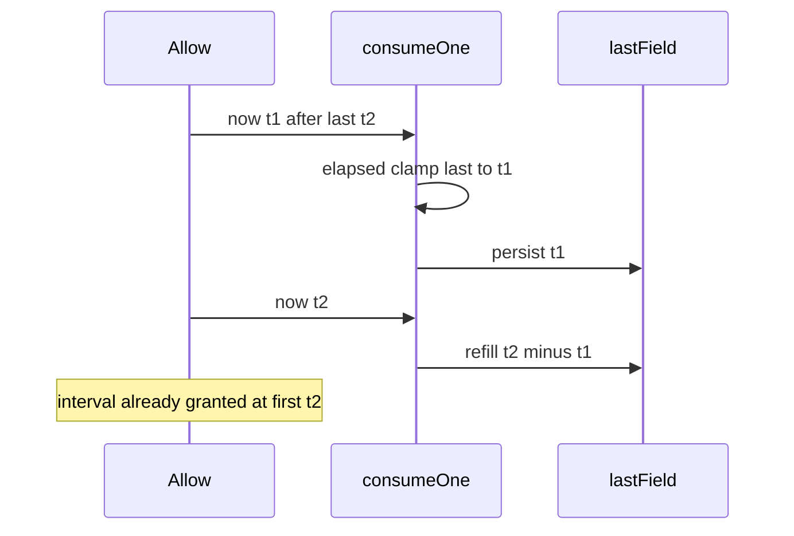

Developer review: in progress — 2026-09-13T06:11:17Z

## What this changes
**Operators.** None.

**Admin users.** None.

**Developers.** None.

**End users.** None.

## Motivation
On dest, token-bucket `Allow` persists `last` as the consume’s now. Elapsed already clamps when now is behind `last`, so refill is not negative — but the stored `last` still becomes that earlier now. Lua `HSET` writes `t` the same way. Memory samples the clock before taking `mu`, so a stale now can overwrite a newer `last`.

A sequential consume at t2, then a backward t1, then t2 again refills the interval already granted. Two goroutines can do the same when the stale sample waits outside the lock while the fresh consume runs first. The limiter then admits a request it already charged.

If this stays unmerged, a clock jump backward or a stale sample under concurrency grants extra tokens. The agreed fix is persist `max(previous last, now)`, keep the elapsed clamp, and read now after the memory lock.

## Merge readiness
Prepare is grounded; product apply has not started. Explore is next.

Priority: P1 — serving a wrong public contract today
Reviewed head: fc79c02
Owner decision: None.

## Review scores
| Measure | Result | What it means |
| --- | --- | --- |
| Overall readiness | 3/6 | CI still queued; no product apply yet |
| CI proof | 3/6 | Checks queued on the stub PR |
| Local tests proof | N/A | Before implement (`localTests: none`) |
| Review resolution | 6/6 | OPEN PR, no review comments |

## Verification
| Check | Result | Evidence |
| --- | --- | --- |
| Branch | 2026-09-13-tokenbucket-bug-last-not-rewind pushed | `git push` `fc79c02` |
| OpenSpec | none | no change folder |
| Pull request | https://github.com/david-garcia-garcia/traefik-middleware-utilities/pull/55 | pr-host Create |
| CI | build 34742068167 in progress https://github.com/david-garcia-garcia/traefik-middleware-utilities/actions/runs/34742068167 | pr-host CI |
| Local tests | none | handoff.yaml localTests |
| PR comments | no comments | inventory empty |

## Specs
None.

## Deviations from the ask
None.

## Follow-up issues
None.

## How this fits together
Local ticket, branch `2026-09-13-tokenbucket-bug-last-not-rewind` from `origin/master` (tokenbucket present; `origin/HEAD` is stale `initial`). Stub PR #55 is the durable card. Next is explore.

## Explore Decisions
None.

## Before merge
- [ ] Land tokenbucket tests that fail on dest for last rewind (sequential and goroutine stale-sample), then persist `max(previous last, now)` in `consumeOne` and Lua `HSET`, and sample now after the memory lock
- [ ] Fold last-not-in-the-past into the tokenbucket allow / lua-eval specs and usage packet

## Findings
None.

## Axis review
None.

## Agent review details

### Review metrics
| Metric | Value | Why it matters |
| --- | --- | --- |
| Specs in this PR | none | Same list as ## Specs |
| Open reviewer comments walked | 0 FIX / 0 ANSWER / 0 open | Unanswered review is merge risk |
| Reviewed head | fc79c02d43c47db693be07f60546c3cad42d6243 | Card must match the branch you measured |

### Stored data model
None.

### Technical review
Best possible solution: Dest still persists backward `now` as `last`; the ticket’s persist-max plus lock-order clock is the how.

Do we have a high-confidence way to reproduce? Yes, dest `consumeOne` returns `nowMicro` after the elapsed clamp, Lua `HSET last, t`, and Memory samples `now` before `mu.Lock()`.

Is this the best way to solve the issue? Yes — fixing only the goroutine sample order would leave sequential rewind; dropping the elapsed clamp would invent negative refill.

### Evidence
What I checked:
- `tokenbucket/` exists on `origin/master` at `d69f89d` (`git ls-tree`)
- `consumeOne` returns `nowMicro` (`tokenbucket/clock.go`); Lua `HSET last, t` (`tokenbucket/lua.go`); Memory samples before lock (`tokenbucket/memory.go`)
- Dest has no `repro_hunt_clock_last_backward_test.go`; dest `Allow` is `(ctx, key) (bool, time.Duration, error)`
- Stub PR #55, comment inventory empty, CI run 34742068167 queued

### Rank-up moves
None.
