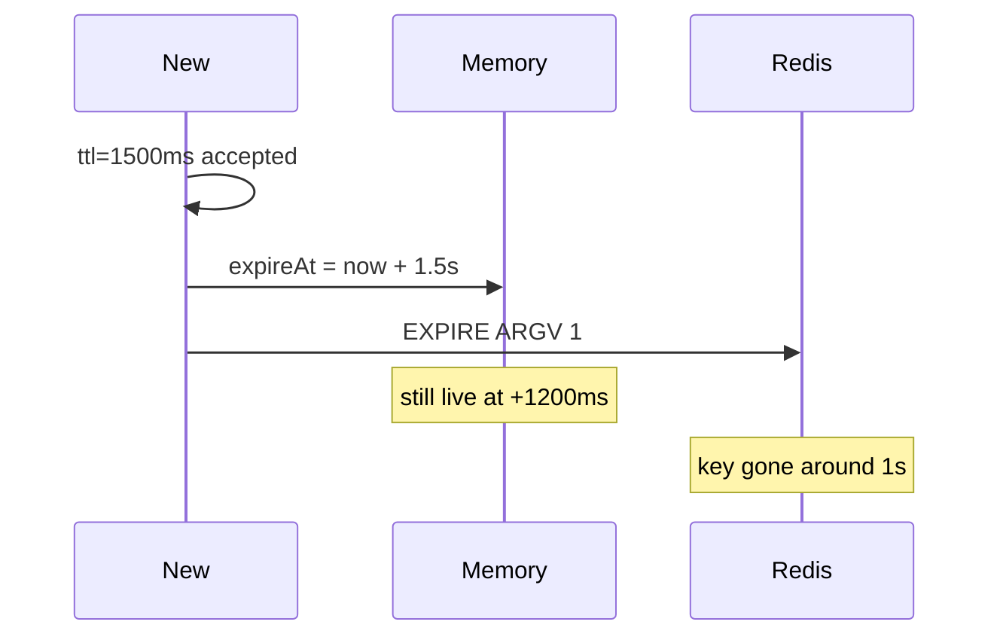

Developer review: in progress — 2026-09-13T06:16:37Z

## What this changes
**Operators.** None.

**Admin users.** None.

**Developers.** None.

**End users.** None.

## Motivation
On dest, `NewMemory` and `NewRedis` share one `validateClock`. That gate only rejects `ttl` under 1s, so 1500ms is a legal constructor argument. Memory then expires the key at `now.Add(ttl)` (1.5s). Redis EVAL ARGV is `int64(ttl / time.Second)`, so Traefik’s `EXPIRE` is 1.

The same Allow sequence is supposed to mean the same thing on both stores. With 1500ms it does not: Memory still holds the depleted bucket at +1200ms while Redis has already been told to drop the key after 1s. New accepted a Duration Redis cannot represent.

If this stays unmerged, a caller that passes a fractional-second ttl gets different lifetimes depending on which store is wired. The agreed how is reject that ttl at `validateClock` (same `errTTL`, still `>= 1s`, whole seconds only). Do not PEXPIRE, rewrite Lua, or floor Memory while New(1500ms) succeeds.

## Merge readiness
Explore recorded proceed policies; product apply has not started.

Priority: P2 — stores can expire the same key at different times when ttl is not a whole second
Reviewed head: cf734e6
Owner decision: None.

## Review scores
| Measure | Result | What it means |
| --- | --- | --- |
| Overall readiness | 3/6 | CI in progress; no product apply yet |
| CI proof | 3/6 | Checks queued on the stub PR |
| Local tests proof | N/A | Before implement (`localTests: none`) |
| Review resolution | 6/6 | OPEN PR, no review comments |

## Verification
| Check | Result | Evidence |
| --- | --- | --- |
| Branch | 2026-09-13-tokenbucket-bug-ttl-whole-seconds pushed | `git push` `cf734e6` |
| OpenSpec | none | no change folder |
| Pull request | https://github.com/david-garcia-garcia/traefik-middleware-utilities/pull/57 | pr-host Create |
| CI | build 34742332834 in progress https://github.com/david-garcia-garcia/traefik-middleware-utilities/actions/runs/34742332834 | pr-host CI (head `cf734e6`) |
| Local tests | none | handoff.yaml localTests |
| PR comments | no comments | inventory empty |

## Specs
None.

## Deviations from the ask
None.

## Follow-up issues
None.

## How this fits together
Local ticket, branch `2026-09-13-tokenbucket-bug-ttl-whole-seconds` from `origin/master`. Stub PR #57 is the durable card. Explore is written; propose is next.

## Explore Decisions
| Question | Rank | Decision | By |
| --- | --- | --- | --- |
| What exact `errTTL` string after the whole-second gate? | additive asked | assumed — keep sentinel `errTTL`; set the text to `tokenbucket: ttl must be a whole number of seconds (at least 1s)`. One check: `ttl < time.Second || ttl%time.Second != 0`. | explore |
| Where does the adapted repro live after the reshape? | additive asked | assumed — land `tokenbucket/ttl_truncation_test.go` (drop `repro_` once it is the contract). Adapt `Allow` to dest `(ctx, key) (bool, time.Duration, error)`. After the fix, assert `errors.Is(err, errTTL)` for 1500ms on both constructors; keep 2s accepted. Do not keep ARGV=`1` / Memory-at-+1200ms as the post-fix contract. | explore |
| Is NewRedis(1500ms) a dedicated case or only Memory plus shared `validateClock`? | additive asked | assumed — both constructors call `validateClock`; the test calls both NewMemory and NewRedis with 1500ms and `errors.Is(..., errTTL)`. 2s still succeeds on both. Dest ARGV/`+1200ms` proof exists only in the failing-first version of that test. | explore |

## Before merge
- [ ] Land tokenbucket tests that fail on dest for New(1500ms) accepted, Redis ARGV ttl 1, Memory still live at +1200ms, then reject fractional ttl at validateClock and keep 2s accepted
- [ ] Fold whole-second ttl into the tokenbucket allow spec and usage packet

## Findings
None.

## Axis review
None.

## Agent review details

### Review metrics
| Metric | Value | Why it matters |
| --- | --- | --- |
| Specs in this PR | none | Same list as ## Specs |
| Open reviewer comments walked | 0 FIX / 0 ANSWER / 0 open | Unanswered review is merge risk |
| Reviewed head | cf734e6369b928628f5bae88cbef84989d23dc5a | Card must match the branch you measured |

### Stored data model
None.

### Technical review
Best possible solution: Dest still accepts 1500ms then disagrees on lifetime; the ticket’s whole-second `validateClock` (same `errTTL`) is the how.

Do we have a high-confidence way to reproduce? Yes — dest NewMemory/NewRedis with 1500ms succeed; Redis EVAL ARGV ttl is `"1"`; Memory still admits at +1200ms (throwaway probe, deleted, not committed).

Is this the best way to solve the issue? Yes — PEXPIRE or flooring Memory while New succeeds would leave Redis unable to represent the Duration New accepted.

### Evidence
What I checked:
- `validateClock` / `ttlSeconds` (`tokenbucket/clock.go`); `expireAt = now.Add(ttl)` (`tokenbucket/memory.go`); Redis ARGV (`tokenbucket/redis.go`); Lua `expire` (`tokenbucket/lua.go`)
- Dest probe: NewMemory/NewRedis accept 1500ms; ARGV index 6 is `"1"`; Memory admits at +1200ms (`go test -short -run TestExploreProbe_DestAcceptsFractionalTTL`, then deleted)
- Usage `knowledge/devdocs/std_go_tokenbucket.md` still documents `ttl < 1s` only (true on dest)
- Research `ext_redis_expire` / `ext_traefik_ratelimiter_token-bucket`: EXPIRE integer seconds; Traefik ttl is 2s or `1+int(1/rtl)`
- Stub PR #57, CI run 34742332834 queued

### Rank-up moves
None.
