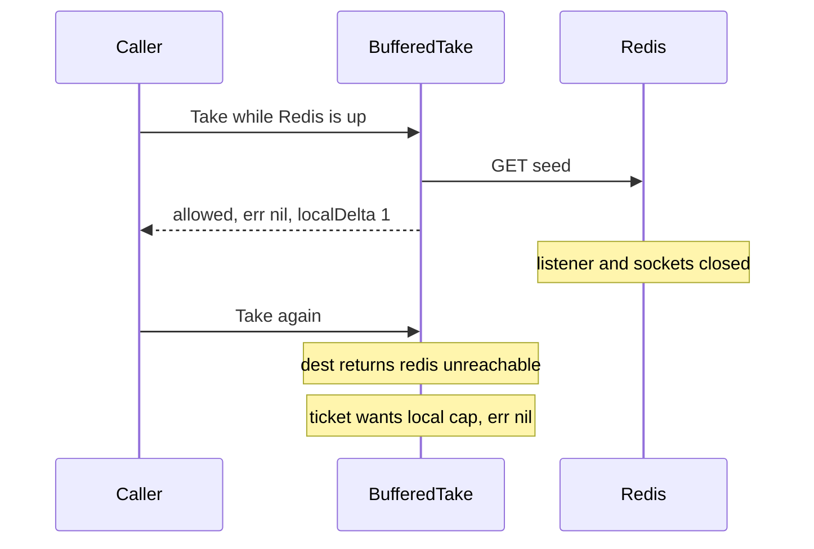

Developer review: in progress — 2026-09-13T07:04:42Z

## What this changes
**Operators.** None.

**Admin users.** None.

**Developers.** None.

**End users.** None.

## Motivation
Buffered `Take` is supposed to keep this node's `limit` when Redis is down (`err=nil`), not fail the site closed. On `master` that path already returns a retained flush error or probes Redis after one missed `sync_rate` (PR #30). Callers that check `err` then fail closed; the global cap is gone anyway, and the node still had a local cap.

The dest tests lock that error (`TestTake_BufferedPendingDeltaOutage` and siblings). The agreed contract is the opposite: nil error, admit until this instance's `limit`, then local deny. Exact mode still returns Redis errors. If this PR does not land, the next change keeps treating fail-closed as the buffered-outage contract, and the lock tests never prove the accepted fallback.

## Merge readiness
Prepare grounded the ticket (`qualified`) and opened stub PR #62. Product apply has not started. 2 items remain.

Priority: P2 — dest buffered Take returns a Redis error on outage so callers that check err fail closed, with a local-cap workaround if they ignore err
Reviewed head: 40759fb
Owner decision: None.

## Review scores
| Measure | Result | What it means |
| --- | --- | --- |
| Overall readiness | 3/6 | CI on the stub is still in progress |
| CI proof | 3/6 | build 34744327756 in progress https://github.com/david-garcia-garcia/traefik-middleware-utilities/actions/runs/34744327756 |
| Local tests proof | N/A | before implement (`localTests: none`); remote CI covers this host |
| Review resolution | 6/6 | OPEN PR, no review comments |

## Verification
| Check | Result | Evidence |
| --- | --- | --- |
| Branch | 2026-09-13-windowcounter-bug-buffered-outage pushed | `git push` origin HEAD `40759fb` |
| OpenSpec | none | `openspec/` unchanged vs `origin/master` |
| Pull request | https://github.com/david-garcia-garcia/traefik-middleware-utilities/pull/62 | pr-host Create |
| CI | build 34744327756 in progress https://github.com/david-garcia-garcia/traefik-middleware-utilities/actions/runs/34744327756 | pr-host check runs |
| Local tests | none | handoff.yaml localTests |
| PR comments | no comments | inventory empty |

## Specs
None.

## Deviations from the ask
None.

## Follow-up issues
None.

## How this fits together
Local ticket `2026-09-13-windowcounter-bug-buffered-outage` on that branch, stub PR #62 against `master`, CI run 34744327756 in progress. No product delta versus `origin/master` yet.

## Explore Decisions
None.

## Before merge
- [ ] Lock buffered Take outage as nil error plus local deny after `limit` (tests, spec, usage docs)
- [x] Stub PR #62
- [x] Requirement `qualified`

## Findings
None.

## Axis review
None.

## Agent review details

### Review metrics
| Metric | Value | Why it matters |
| --- | --- | --- |
| Specs in this PR | none | Same list as ## Specs |
| Open reviewer comments walked | 0 FIX / 0 ANSWER / 0 open | Unanswered review is merge risk |
| Reviewed head | 40759fb05a4ffe0c2ce7bfbe365183090dba0cbf | Card must match the branch you measured |

### Stored data model
None.

### Technical review
Best possible solution: versus `master`, stop returning a Redis error from buffered Take on outage and lock per-node `limit` with `err=nil`; keep exact mode errors.

Do we have a high-confidence way to reproduce? Yes, dest `TestTake_BufferedPendingDeltaOutage` wants a Redis error after `Kill`, and the caller repro asserts `redis:unreachable`.

Is this the best way to solve the issue? Yes — rewrite the dest fail-closed tests and spec rather than adding GET/INCR on every buffered Take.

### Evidence
What I checked:
- `windowcounter/limiter.go` `takeBuffered` returns `bufferedOutageErrorLocked` (`40759fb` tree, dest `120ebde`)
- `openspec/specs/std_go_windowcounter_sliding-take/spec.md` buffered pending-delta must not return nil
- Stub PR #62, CI run 34744327756 queued/in progress

### Rank-up moves
None.
