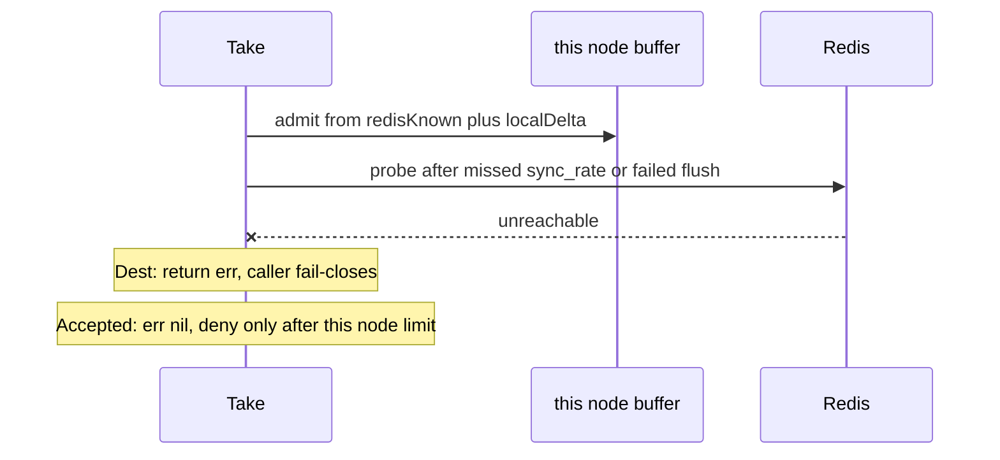

Developer review: ready for review — 2026-09-13T08:28:49Z

## What this changes
**Operators.** Buffered Take and Peek while Redis is down keep this node's `limit` and return a nil error. Exact mode (`sync_rate == 0`) still returns Redis errors. Do not treat a nil error as a global cap.

**Admin users.** None.

**Developers.** `windowcounter` buffered Take/Peek no longer return a Redis error on outage. Live specs `std_go_windowcounter_sliding-take` and `std_go_windowcounter_sync-flush`, usage, and README lock the per-node cap. Failed GET/flush is stored on `lastOutageErr` so later calls skip Redis.

**End users.** None.

## Motivation
Buffered Take is meant to keep this node's own `limit` when Redis is gone, with `err=nil`. Dest admits from the local buffer, then returns a Redis error after a missed sync or a failed flush. Callers that check `err` fail closed instead of staying at the per-node cap.

If we do not merge, tests and specs keep locking that fail-closed path, and the accepted fallback cannot land without rewriting those locks first.

## Merge readiness
CI on HEAD succeeded. 0 items remain.

Priority: P2 — Redis outage currently surfaces as buffered Take errors instead of the accepted per-node cap, limited to buffered mode
Reviewed head: 6e2f116
Owner decision: None.

## Review scores
| Measure | Result | What it means |
| --- | --- | --- |
| Overall readiness | 6/6 | CI succeeded, comments empty, local tests passed |
| CI proof | 6/6 | succeeded — https://github.com/david-garcia-garcia/traefik-middleware-utilities/actions/runs/34747682852 |
| Local tests proof | N/A | `localTests: passed`; remote CI is the proof axis |
| Review resolution | 6/6 | no OPEN PR comments |

## Verification
| Check | Result | Evidence |
| --- | --- | --- |
| Branch | 2026-09-13-windowcounter-bug-buffered-outage pushed | `git` tracking origin |
| OpenSpec | windowcounter-buffered-outage-local-cap | `openspec/changes/archive/2026-09-13-windowcounter-buffered-outage-local-cap/` |
| Pull request | https://github.com/david-garcia-garcia/traefik-middleware-utilities/pull/62 | pr-host List |
| CI | build 34747682852 success https://github.com/david-garcia-garcia/traefik-middleware-utilities/actions/runs/34747682852 | pr-host CI |
| Local tests | passed | handoff.yaml localTests |
| PR comments | no comments | comments: none |

## Specs
- [std_go_windowcounter_sliding-take](https://github.com/david-garcia-garcia/traefik-middleware-utilities/blob/2026-09-13-windowcounter-bug-buffered-outage/openspec/changes/archive/2026-09-13-windowcounter-buffered-outage-local-cap/proposal.md) — modified
- [std_go_windowcounter_sync-flush](https://github.com/david-garcia-garcia/traefik-middleware-utilities/blob/2026-09-13-windowcounter-bug-buffered-outage/openspec/changes/archive/2026-09-13-windowcounter-buffered-outage-local-cap/proposal.md) — modified

## Deviations from the ask
- taken: ticket named buffered Take only → buffered Peek uses the same nil-error local observation — `windowcounter/limiter.go` `peekBuffered` — Language already defines Peek as that observation without a hit. Requester: not asked.
- taken: dest “Redis errors propagate” / retained-flush fail-closed → buffered outage is nil error plus local deny after this node’s `limit` — `openspec/specs/std_go_windowcounter_sliding-take/spec.md` — honouring dest wording would keep returning a Redis error, which Desired 4 forbids. Requester: confirmed.

## Follow-up issues
- [ ] [Cap `windows` during buffered Redis outage](https://github.com/david-garcia-garcia/traefik-middleware-utilities/blob/2026-09-13-windowcounter-bug-buffered-outage/knowledge/debt/2026-09-13-windowcounter-outage-windows-unbounded.md) — during a Redis outage, buffered Take can grow `windows` with unique keys until Redis recovers.

## How this fits together
Ticket is local. Branch `2026-09-13-windowcounter-bug-buffered-outage` is OPEN PR #62 into `master`. Change archived. CI run 34747682852 succeeded on 6e2f116.

## Explore Decisions
None.

## Before merge
None.

## Findings
None.

## Axis review
[Standards](https://github.com/david-garcia-garcia/traefik-middleware-utilities/blob/2026-09-13-windowcounter-bug-buffered-outage/devstate/2026/09/2026-09-13-windowcounter-bug-buffered-outage/codereview_standards.md) — 1 total, 0 pending, 1 completed
[Nitpicks](https://github.com/david-garcia-garcia/traefik-middleware-utilities/blob/2026-09-13-windowcounter-bug-buffered-outage/devstate/2026/09/2026-09-13-windowcounter-bug-buffered-outage/codereview_nitpicks.md) — 2 total, 0 pending, 2 completed
[Spec](https://github.com/david-garcia-garcia/traefik-middleware-utilities/blob/2026-09-13-windowcounter-bug-buffered-outage/devstate/2026/09/2026-09-13-windowcounter-bug-buffered-outage/codereview_spec.md) — 0 total, 0 pending, 0 completed
[Security](https://github.com/david-garcia-garcia/traefik-middleware-utilities/blob/2026-09-13-windowcounter-bug-buffered-outage/devstate/2026/09/2026-09-13-windowcounter-bug-buffered-outage/codereview_security.md) — 1 total, 0 pending, 0 completed, 1 skipped
[Performance](https://github.com/david-garcia-garcia/traefik-middleware-utilities/blob/2026-09-13-windowcounter-bug-buffered-outage/devstate/2026/09/2026-09-13-windowcounter-bug-buffered-outage/codereview_performance.md) — 1 total, 0 pending, 0 completed, 1 skipped
[Dead](https://github.com/david-garcia-garcia/traefik-middleware-utilities/blob/2026-09-13-windowcounter-bug-buffered-outage/devstate/2026/09/2026-09-13-windowcounter-bug-buffered-outage/codereview_dead.md) — 1 total, 0 pending, 1 completed
[Test coverage](https://github.com/david-garcia-garcia/traefik-middleware-utilities/blob/2026-09-13-windowcounter-bug-buffered-outage/devstate/2026/09/2026-09-13-windowcounter-bug-buffered-outage/codereview_coverage.md) — 2 total, 0 pending, 1 completed, 1 skipped

## Agent review details

### Review metrics
| Metric | Value | Why it matters |
| --- | --- | --- |
| Specs in this PR | 0 added / 2 modified | Same list as ## Specs |
| Open reviewer comments walked | 0 FIX / 0 ANSWER / 0 open | Unanswered review is merge risk |
| Reviewed head | 6e2f116f53581ab25347665820bd7d029c276399 | Card must match the branch you measured |

### Stored data model
None.

### Technical review
Best possible solution: dest fail-closed buffered outage is replaced with per-node cap and `err=nil`; exact mode still returns Redis errors.

Do we have a high-confidence way to reproduce? Yes, dest outage tests were rewritten to the agreed lock; `go test -short ./windowcounter` passed.

Is this the best way to solve the issue? Yes, the ticket wins over dest PR #30 fail-closed specs without probing Redis on every Take.

### Evidence
What I checked:
- `go test -short -count=1 -timeout 60s ./windowcounter` passed (6e2f116)
- GitHub check runs on PR #62: Lint, Unit, Unit race, Integration Tests, Integration Tests Redis, Integration Tests Dragonfly, Go E2E Redis, Go E2E Dragonfly all success (build 34747682852)
- `origin/master` is an ancestor of HEAD after reclaim canceled-bind merge

### Rank-up moves
None.
