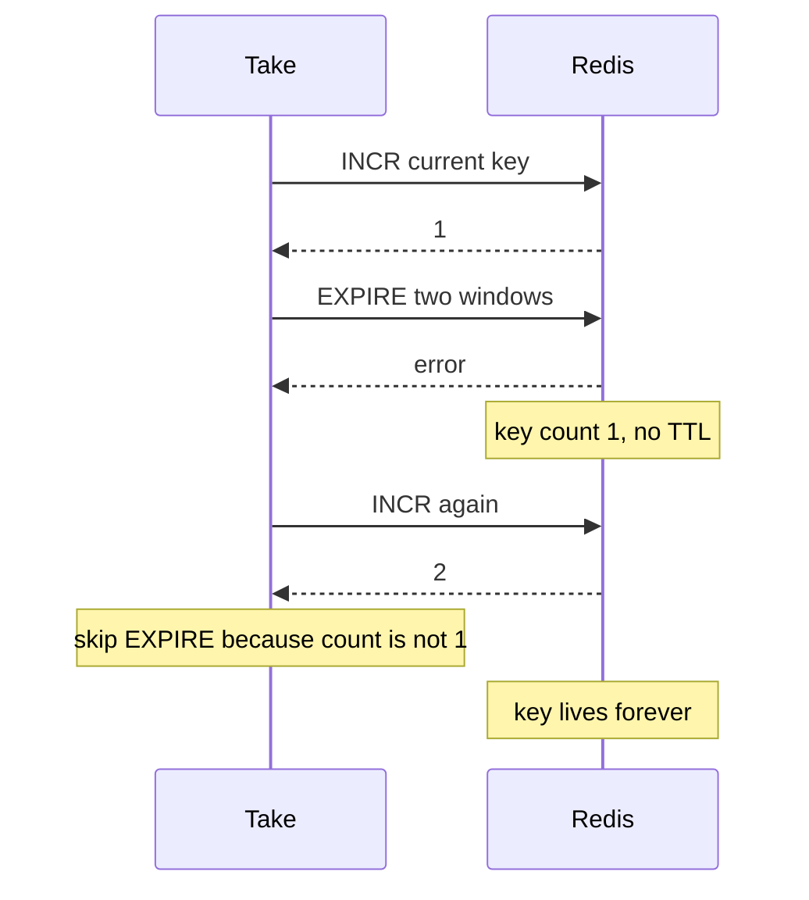

Developer review: in progress — 2026-09-13T07:03:25Z

## What this changes
**Operators.** None.

**Admin users.** None.

**Developers.** None.

**End users.** None.

## Motivation
Exact `Take` (`sync_rate == 0`) is supposed to put a two-window TTL on the current-window Redis key so the sliding count can empty. On master that TTL is a second command after `INCR`, and only when the increment returns 1.

If that `EXPIRE` fails, Redis already holds the key at count ≥ 1 with no TTL. The failed Take still occupied the window. The next Take sees `INCR` = 2 and never sends `EXPIRE`. That opaque key never slides off: later Takes stay denied until someone deletes it, and Redis keeps the key.

If this stays unmerged, a single failed first-hit expire permanently sticks that key’s window. `TestTake_ExpireOnFirstHit` only proves a healthy first Take; it does not fail Expire or Take again.

## Merge readiness
Prepare grounded this bug and opened stub PR 60. Product apply has not started. 3 items remain.

Priority: P1 — after one failed first-hit Expire the window key never expires and that key stays denied
Reviewed head: d70c193
Owner decision: None.

## Review scores
| Measure | Result | What it means |
| --- | --- | --- |
| Overall readiness | 3/6 | Stub PR exists; no product apply; CI in progress |
| CI proof | 3/6 | Checks in progress on the stub PR |
| Local tests proof | N/A | Before implement (`localTests: none`) |
| Review resolution | 6/6 | OPEN PR, no review comments |

## Verification
| Check | Result | Evidence |
| --- | --- | --- |
| Branch | 2026-09-13-windowcounter-bug-expire-not-retried pushed | `git` origin/2026-09-13-windowcounter-bug-expire-not-retried |
| OpenSpec | none | `openspec/` |
| Pull request | https://github.com/david-garcia-garcia/traefik-middleware-utilities/pull/60 | pr-host Create |
| CI | build 34744267597 in progress https://github.com/david-garcia-garcia/traefik-middleware-utilities/actions/runs/34744267597 | pr-host CI |
| Local tests | none | handoff.yaml localTests |
| PR comments | no comments | inventory empty |

## Specs
None.

## Deviations from the ask
None.

## Follow-up issues
None.

## How this fits together
Local ticket 2026-09-13-windowcounter-bug-expire-not-retried is on its branch from origin/master. Stub PR 60 is the durable card host. CI is queued on that head.

## Explore Decisions
None.

## Before merge
- [ ] [P1] Create the failing repro first (`windowcounter/repro_expire_not_retried_test.go`, port fake expire-fail helpers), confirm FAIL, then exact Take EVAL INCR plus EXPIRE if PTTL < 0, then PASS `go test -short -count=1 -timeout 60s ./windowcounter`
- [ ] Keep `TestTake_ExpireOnFirstHit`
- [ ] CI succeeded on PR 60
- [x] Stub PR open
- [x] Requirement grounded on dest `takeExact`

## Findings
None.

## Axis review
None.

## Agent review details

### Review metrics
| Metric | Value | Why it matters |
| --- | --- | --- |
| Specs in this PR | none | Same list as ## Specs |
| Open reviewer comments walked | 0 FIX / 0 ANSWER / 0 open | Unanswered review is merge risk |
| Reviewed head | d70c1934976ac7f125dd7e5a8515b94b08691c46 | Card must match the branch you measured |

### Stored data model
None.

### Technical review
Best possible solution: not applied yet versus dest `takeExact` INCR-then-EXPIRE-on-1.

Do we have a high-confidence way to reproduce? Yes — fail the first `EXPIRE`, then a later Take increments to 2 and never expires (`windowcounter/limiter.go` `takeExact`).

Is this the best way to solve the issue? Yes versus dest: one EVAL that expires when `PTTL < 0` cannot leave a no-TTL key the way two commands can; do not DEL and do not refresh TTL on every hit.

### Evidence
What I checked:
- `takeExact` Expires only when `Incr` returns 1 (`windowcounter/limiter.go`, origin/master `120ebde`)
- Dest fake has no expire-fail helpers and no PTTL (`windowcounter/fake_redis_test.go`)
- `TestTake_ExpireOnFirstHit` is a healthy first Take only (`windowcounter/limiter_test.go`)
- Spec still says TTL when increment returns 1 (`openspec/specs/std_go_windowcounter_sync-flush/spec.md`)
- Stub PR 60; CI run 34744267597 queued; product diff `origin/master...HEAD` excluding `devstate/` is empty

### Rank-up moves
None.
