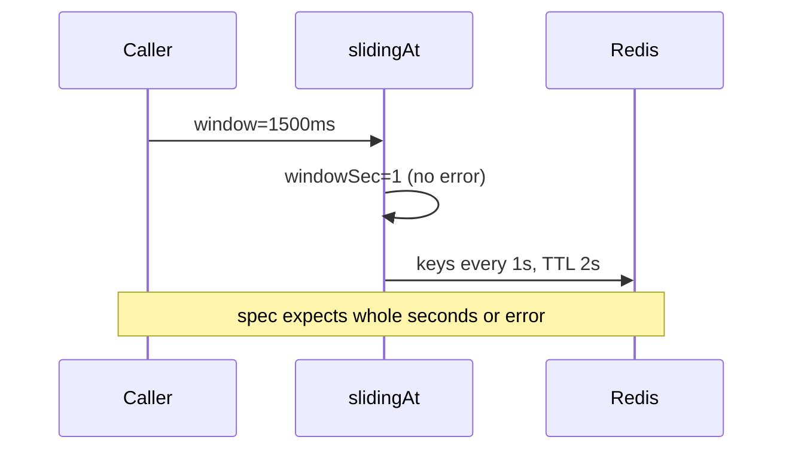

Developer review: in progress — 2026-09-13T07:00:23Z

## What this changes
**Operators.** None.

**Admin users.** None.

**Developers.** None yet on dest; prepare grounded the fractional-window bug in `windowcounter/limiter.go` `slidingAt`.

**End users.** None.

## Motivation
Traefik sliding-window rate limits pass a `window` Duration into `windowcounter`. The spec says that length must be a whole number of seconds. On master, `slidingAt` only rejects windows under one second after integer division, so 1500ms is accepted.

That window is then truncated to one-second Redis buckets (`windowSec == 1`) while weight math still uses the full 1.5s Duration. Keys roll every second and TTL is two seconds, not two window lengths. A caller who configures 1.5s gets silent 1s bucket behavior instead of an error.

If we ship without fixing this, misconfigured fractional windows undercount or mis-weight hits relative to the limit the operator thought they set. The agreed fix is reject non-whole-second windows at `slidingAt`, keep sub-second rejection, and prove with a failing-then-green repro.

## Merge readiness
Prepare complete; product fix not started. 4 items remain.

Priority: P2 — fractional windows silently use 1s buckets instead of rejecting
Reviewed head: 8a119b8
Owner decision: None.

## Review scores
| Measure | Result | What it means |
| --- | --- | --- |
| Overall readiness | 1/6 | CI not measured yet; no product change on branch |
| CI proof | 1/6 | Branch pushed; checks not seen |
| Local tests proof | N/A | Before implement (`localTests: none`) |
| Review resolution | 6/6 | OPEN PR; no review comments inventoried |

## Verification
| Check | Result | Evidence |
| --- | --- | --- |
| Branch | 2026-09-13-windowcounter-bug-fractional-window pushed | `git push` `8a119b8` |
| OpenSpec | none | no change folder yet |
| Pull request | https://github.com/david-garcia-garcia/traefik-middleware-utilities/pull/58 | GitHub Create |
| CI | not seen | not measured this phase |
| Local tests | none | handoff.yaml |
| PR comments | no comments | comments: none |

## Specs
None.

## Deviations from the ask
None.

## Follow-up issues
None.

## How this fits together
Local ticket → branch `2026-09-13-windowcounter-bug-fractional-window` → stub PR #58 → CI pending.

## Explore Decisions
None.

## Before merge
- [ ] [P2] Explore requirement and code paths for fractional window rejection
- [ ] [P2] Propose OpenSpec delta if spec wording needs construction-time reject
- [ ] [P2] Implement repro-first fix per `requirement.md`
- [ ] [P2] Run `./windowcounter` tests and wait for green CI

## Findings
None.

## Axis review
None.
