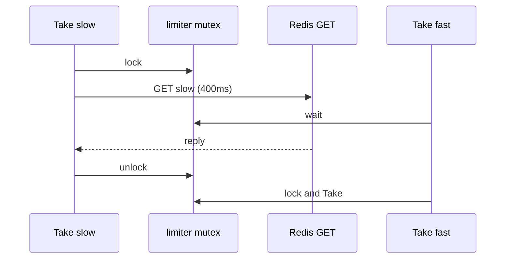

Developer review: in progress — 2026-09-13T07:02:55Z

## What this changes
**Operators.** None.

**Admin users.** None.

**Developers.** None.

**End users.** None.

## Motivation
Buffered sliding-window Take on dest still holds the limiter mutex while Redis GET or Eval runs. Unrelated keys on the same limiter wait for that round trip.

On dest, a delayed GET for opaque key `slow` keeps `l.mu` until the GET returns. A concurrent Take on `fast` cannot start until that GET finishes — about 400ms in the caller repro. Exact mode does not take that mutex.

If this does not merge, one slow Redis read on one key stalls every buffered Take and Peek on that process for the full GET or Eval delay. Shared limiters on the request path serialize on Redis latency.

## Merge readiness
Prepare grounded the HOLB. Explore has not started. Product delta versus master is the empty stub commit only.

Priority: P2 — one Redis GET on a buffered limiter holds all Takes on that process for the GET duration.
Reviewed head: 34a5895
Owner decision: None.

## Review scores
| Measure | Result | What it means |
| --- | --- | --- |
| Overall readiness | 1/6 | Stub PR is up; CI not seen; no product fix yet |
| CI proof | 1/6 | Pushed; checks not seen |
| Local tests proof | N/A | Before implement; remote PR |
| Review resolution | 6/6 | No PR comments |

## Verification
| Check | Result | Evidence |
| --- | --- | --- |
| Branch | 2026-09-13-windowcounter-bug-lock-during-get pushed | `git` / GitHub |
| OpenSpec | none | `openspec/` |
| Pull request | https://github.com/david-garcia-garcia/traefik-middleware-utilities/pull/59 | pr-host List/Create |
| CI | not seen | pr-host CI |
| Local tests | none | handoff.yaml localTests |
| PR comments | no comments | no comments.md |

## Specs
None.

## Deviations from the ask
None.

## Follow-up issues
None.

## How this fits together
Local spec is in this run’s ticket dump. Branch `2026-09-13-windowcounter-bug-lock-during-get` is cut from master. Stub PR 59 is the durable card host. CI has not been measured.

## Explore Decisions
None.

## Before merge
- [ ] Explore then propose/implement unlock-around-I/O (tests first; exact mode unchanged)
- [x] Stub PR opened
- [x] Requirement qualified-with-gaps

## Findings
None.

## Axis review
None.

## Agent review details

### Review metrics
| Metric | Value | Why it matters |
| --- | --- | --- |
| Specs in this PR | none | Same list as ## Specs; do not paste diff --stat |
| Open reviewer comments walked | 0 FIX / 0 ANSWER / 0 open | Unanswered review is merge risk |
| Reviewed head | 34a5895f6d0bd19a50a6f94a0d70256eb5e51177 | Card must match the branch you measured |

### Stored data model
None.

### Technical review
Best possible solution: dest still GETs and Evals while holding `l.mu`; this PR has not changed that yet.

Do we have a high-confidence way to reproduce? Yes, dest `takeBuffered` / `flushPending` hold `l.mu` across `getCount` / `Eval`; dest fake Redis has no GET-hold helper yet.

Is this the best way to solve the issue? Yes — ticket already names unlock-around-I/O plus merge of `redisKnown` / `localDelta -= flushedDelta`; that matches the dest lock scope.

### Evidence
What I checked:
- dest `windowcounter/limiter.go` `takeBuffered`, `peekBuffered`, `windowLocked`, `flushPendingLocked` (git, origin/master fb3d60a)
- dest `windowcounter/fake_redis_test.go` GET path has no block helpers (git)
- stub PR 59 open, comment lists empty (GitHub MCP)
- qualify `qualified-with-gaps` (handoff.yaml)

### Rank-up moves
None.
