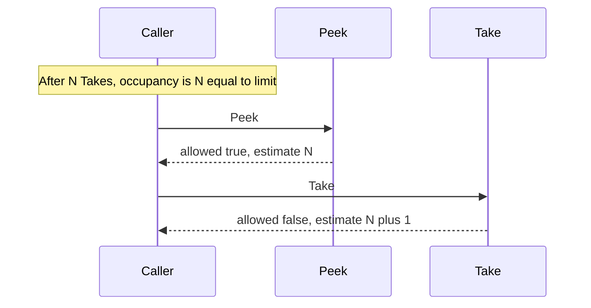

Developer review: in progress — 2026-09-13T07:04:48Z

## What this changes
**Operators.** None.

**Admin users.** None.

**Developers.** None.

**End users.** None.

## Motivation
`windowcounter` Peek is supposed to report already-used occupancy. After exactly `limit` Takes, dest Peek returns allowed true with estimate `limit`, and the next Take returns allowed false with estimate `limit+1`. That is the intended contract.

On `origin/master`, Peek's compare already does occupancy (`estimated <= limit` without adding a hit). The Peek godoc still says “whether a hit would be allowed.” The sliding-take spec scenario says Take's allowed matches Peek's allowed with no “does not cross limit” qualifier. Dest has no occupancy lock at exactly `limit` (`TestPeek_AgreesWithTakeBeforeIncrement` only fills `limit-1`). A parent repro currently fails if those allowed flags differ.

Cost of not merging: a later change can flip Peek to next-hit (occupancy+1), or a caller can treat Peek allowed as “the next Take will admit,” including at exactly `limit` where they differ. This ticket is documentation plus a passing occupancy lock, not a Peek compare change.

## Merge readiness
Prepare grounded occupancy as the dest contract. Explore has not run. Product apply is not on this head. 2 items remain.

Priority: P3 — spec, docs, tests, or internal clarity — dest Peek already occupancy; missing lock and wording
Reviewed head: 9e117ee
Owner decision: None.

## Review scores
| Measure | Result | What it means |
| --- | --- | --- |
| Overall readiness | 3/6 | CI is in progress on the stub PR |
| CI proof | 3/6 | run 34744309814 in progress |
| Local tests proof | N/A | before implement (`localTests: none`) |
| Review resolution | 6/6 | OPEN PR, no comments |

## Verification
| Check | Result | Evidence |
| --- | --- | --- |
| Branch | 2026-09-13-windowcounter-bug-peek-occupancy pushed | `git` origin |
| OpenSpec | none | `openspec/` |
| Pull request | https://github.com/david-garcia-garcia/traefik-middleware-utilities/pull/64 | pr-host Create |
| CI | build 34744309814 in progress https://github.com/david-garcia-garcia/traefik-middleware-utilities/actions/runs/34744309814 | pr-host CI |
| Local tests | none | handoff.yaml localTests |
| PR comments | no comments | no comments.md |

## Specs
None.

## Deviations from the ask
None.

## Follow-up issues
None.

## How this fits together
Local occupancy ticket on branch `2026-09-13-windowcounter-bug-peek-occupancy`, stub PR #64 into `master`, CI run 34744309814 in progress.

## Explore Decisions
None.

## Before merge
- [ ] Occupancy lock test that passes on dest Peek, then Peek godoc, usage Gotchas, and sliding-take spec only
- [ ] Do not change Peek compare to next-hit
- [x] Prepare dump, requirement, qualify, stub PR #64

## Findings
None.

## Axis review
None.

## Agent review details

### Review metrics
| Metric | Value | Why it matters |
| --- | --- | --- |
| Specs in this PR | none | Same list as ## Specs |
| Open reviewer comments walked | 0 FIX / 0 ANSWER / 0 open | Unanswered review is merge risk |
| Reviewed head | 9e117eeaa16029a3ff03409dc64894aec7141c09 | Card must match the branch you measured |

### Stored data model
None.

### Technical review
Best possible solution: keep dest occupancy compare; lock it with a passing test; rewrite Peek godoc, usage, and the sliding-take scenario so “Take's allowed matches Peek's allowed” only when the increment does not cross limit.

Do we have a high-confidence way to reproduce? Yes, dest `peekExact`/`peekBuffered` vs `takeExact`/`takeBuffered` at occupancy `limit`, plus parent `repro_peek_take_boundary_test.go` which currently asserts allowed match.

Is this the best way to solve the issue? Yes — dest Peek already occupancy; changing compare would be the wrong contract.

### Evidence
What I checked:
- Peek occupancy compare (`windowcounter/limiter.go` `peekExact` / `peekBuffered`, dest `120ebde`)
- Take increment-then-compare (`windowcounter/limiter.go` `takeExact` / `takeBuffered`)
- Spec scenario without a limit-crossing qualifier (`openspec/specs/std_go_windowcounter_sliding-take/spec.md`)
- Dest missing `repro_peek_take_boundary_test.go`; `TestPeek_AgreesWithTakeBeforeIncrement` fills `limit-1`
- PR #64, CI run 34744309814 in progress

### Rank-up moves
None.
