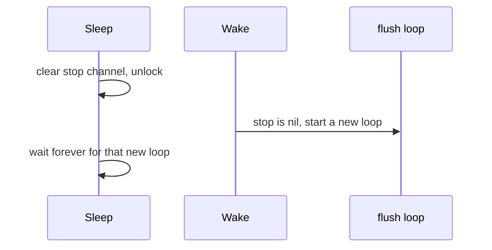

Developer review: in progress — 2026-09-13T07:02:44Z

## What this changes
**Operators.** None.

**Admin users.** None.

**Developers.** None.

**End users.** None.

## Motivation
A Traefik reload puts the window counter to sleep, then wakes it. On master, `Sleep` can wait forever if `Wake` runs in that gap.

`Sleep` clears the stop channel and unlocks, then waits for the flush goroutine. `Wake` sees a nil stop channel and starts a new ticker (`wg.Add(1)`). `Sleep` then waits for a loop nobody will stop. Measured: hung iteration 0 after 2s.

If this stays unmerged, a reload that races Sleep and Wake can hang the process. Sleep must win: a stopping flag set under the mutex before unlock, cleared only after wait and ticker stop. Wake after Sleep still starts a ticker. After Close, Wake must not.

## Merge readiness
Prepare grounded the hang. No product delta versus master yet. 2 items remain.

Priority: P1 — Sleep can hang forever today when Wake races it
Reviewed head: fb59584
Owner decision: None.

## Review scores
| Measure | Result | What it means |
| --- | --- | --- |
| Overall readiness | 3/6 | CI still in progress; no product apply |
| CI proof | 3/6 | run 34744240767 in progress |
| Local tests proof | N/A | before implement |
| Review resolution | 6/6 | no open PR comments |

## Verification
| Check | Result | Evidence |
| --- | --- | --- |
| Branch | 2026-09-13-windowcounter-bug-sleep-wake-hang pushed | git |
| OpenSpec | none | openspec/ |
| Pull request | https://github.com/david-garcia-garcia/traefik-middleware-utilities/pull/61 | GitHub PR 61 |
| CI | build 34744240767 in progress https://github.com/david-garcia-garcia/traefik-middleware-utilities/actions/runs/34744240767 | GitHub check runs |
| Local tests | none | handoff.yaml localTests |
| PR comments | no comments | no comments.md |

## Specs
None.

## Deviations from the ask
None.

## Follow-up issues
None.

## How this fits together
Local spec → branch `2026-09-13-windowcounter-bug-sleep-wake-hang` → [PR 61](https://github.com/david-garcia-garcia/traefik-middleware-utilities/pull/61) → CI run 34744240767 in progress.

## Explore Decisions
None.

## Before merge
- [P1] Sleep must return when Wake races it (failing `TestRepro_SleepWakeRaceHangs` first, then the stopping flag)
- [ ] CI run 34744240767 still in progress

## Findings
None.

## Axis review
None.

## Agent review details

### Review metrics
| Metric | Value | Why it matters |
| --- | --- | --- |
| Specs in this PR | none | Same list as ## Specs |
| Open reviewer comments walked | 0 FIX / 0 ANSWER / 0 open | Unanswered review is merge risk |
| Reviewed head | fb59584ee3ffe8ce939078c536a908365d437ac1 | Card must match the branch you measured |

### Stored data model
None.

### Technical review
Best possible solution: DestBranch `stopFlushAndWait` clears `stop` before `wg.Wait`; the ticket's stopping flag is the smallest Sleep-wins fix.

Do we have a high-confidence way to reproduce? Yes — dest `Wake`/`stopFlushAndWait` match the race; caller hung iteration 0 after 2s; dest has no `TestRepro_SleepWakeRaceHangs`.

Is this the best way to solve the issue? Yes — Sleep wins with a stopping flag; do not change Close-after-Wake.

### Evidence
What I checked:
- dest `windowcounter/limiter.go` `Wake` / `takeFlushTickerLocked` / `stopFlushAndWait` (path, fb3d60a)
- dest `windowcounter/limiter_test.go` `TestClose_StopsTickerAndKeepsRedis` (path)
- dest `openspec/specs/std_go_windowcounter_sync-flush/spec.md` Sleep Wake Close (path)
- GitHub identity get_me (David / deivid.garcia.garcia@gmail.com)
- stub PR 61, check runs queued (run 34744240767)

### Rank-up moves
None.
