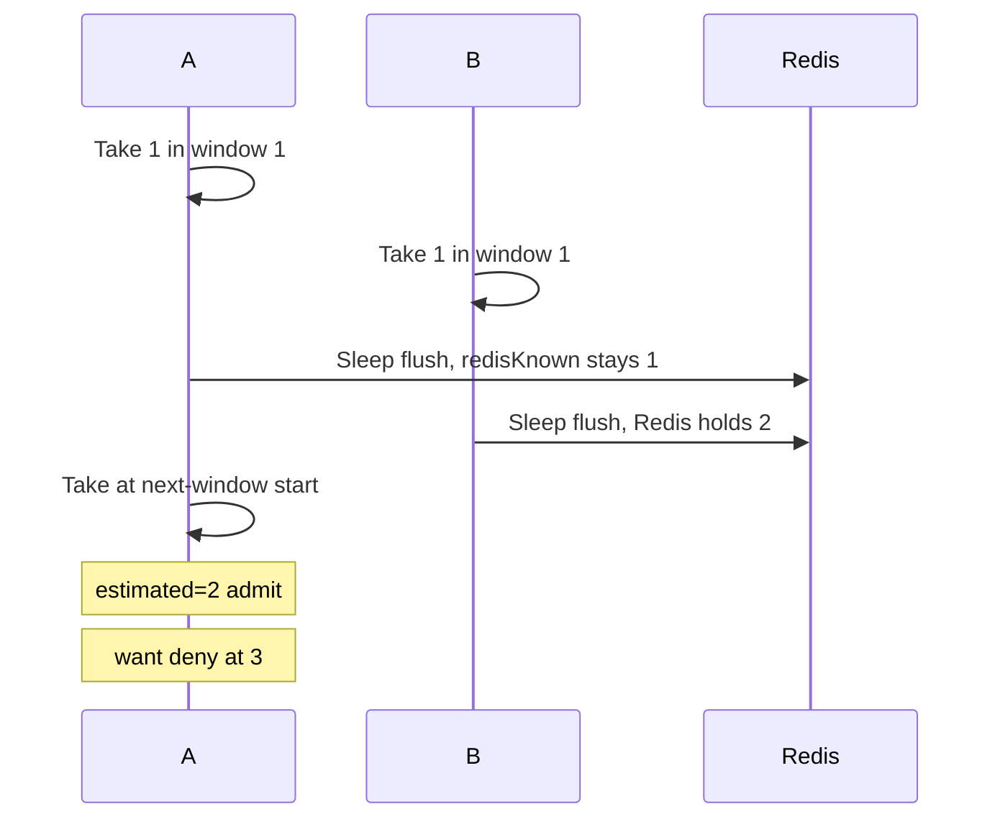

Developer review: in progress — 2026-09-13T07:04:48Z

## What this changes
**Operators.** None.

**Admin users.** None.

**Developers.** None.

**End users.** None.

## Motivation
Buffered Take already GET-refreshes the current window after a flush (`localDelta == 0`). Previous does not: once that Redis key is in memory, the node keeps its own last flush return. Two buffered instances that each hit once, then Sleep in order A then B, leave Redis at 2 and A's previous `redisKnown` at 1.

At the next-window start (weight 1) A's Take estimates 2 and admits. Exact mode would deny at 3 (current 1 + previous 2). Spec says the dump at the roll still includes previous hits and two clients share without last-write-wins. Dest proves that only in exact mode or in the same window.

If this stays unmerged, a node that flushed first can admit about another full `limit` at the roll while Redis is healthy. The agreed how is GET previous on buffered Take when that key is in memory and `localDelta == 0`. Do not INCR previous. Do not GET previous on every Peek. Do not fold into Redis-down policy.

## Merge readiness
Prepare is grounded; product apply has not started. Explore is next.

Priority: P1 — dest buffered Take can admit a second full limit at the window roll
Reviewed head: 5a2e516
Owner decision: None.

## Review scores
| Measure | Result | What it means |
| --- | --- | --- |
| Overall readiness | 3/6 | CI still running; no product apply yet |
| CI proof | 3/6 | Checks in progress on the stub PR |
| Local tests proof | N/A | Before implement (`localTests: none`) |
| Review resolution | 6/6 | OPEN PR, no review comments |

## Verification
| Check | Result | Evidence |
| --- | --- | --- |
| Branch | 2026-09-13-windowcounter-bug-stale-previous pushed | `git push` `5a2e516` |
| OpenSpec | none | no change folder |
| Pull request | https://github.com/david-garcia-garcia/traefik-middleware-utilities/pull/63 | pr-host Create |
| CI | build 34744255712 in progress https://github.com/david-garcia-garcia/traefik-middleware-utilities/actions/runs/34744255712 | pr-host CI (head `5a2e516`) |
| Local tests | none | handoff.yaml localTests |
| PR comments | no comments | inventory empty |

## Specs
None.

## Deviations from the ask
None.

## Follow-up issues
None.

## How this fits together
Local ticket, branch `2026-09-13-windowcounter-bug-stale-previous` from `origin/master` (windowcounter present). Stub PR #63 is the durable card. Next is explore.

## Explore Decisions
None.

## Before merge
- [ ] Land a failing-then-green test that denies at estimated 3 after A.Sleep then B.Sleep and next-window Take
- [ ] Buffered Take GET previous when that key is in memory and `localDelta == 0`; keep memory when `localDelta > 0`; do not INCR previous; do not GET previous on every Peek; do not fold into Redis-down

## Findings
None.

## Axis review
None.

## Agent review details

### Review metrics
| Metric | Value | Why it matters |
| --- | --- | --- |
| Specs in this PR | none | Same list as ## Specs |
| Open reviewer comments walked | 0 FIX / 0 ANSWER / 0 open | Unanswered review is merge risk |
| Reviewed head | 5a2e5167a772994a54274a02d77e79ca98fcb687 | Card must match the branch you measured |

### Stored data model
None.

### Technical review
Best possible solution: Dest `bufferedCountLocked` never GETs a key already in `l.windows`; `windowLocked` already GETs current when `localDelta == 0`. Ticket is that same refresh for previous on Take only.

Do we have a high-confidence way to reproduce? Yes — two buffered clients, one Take each at `start+9s`, A.Sleep then B.Sleep, clock `start+10s`, A's Take admits estimated 2.

Is this the best way to solve the issue? Yes — INCR previous or GET on every Peek would break skip-storm and mix this with outage policy.

### Evidence
What I checked:
- `windowcounter/` exists on `origin/master` (`git ls-tree`; dest HEAD `120ebde`)
- `bufferedCountLocked` / `windowLocked` / `takeBuffered` / `peekBuffered` (`windowcounter/limiter.go`)
- Dest tests: exact sliding boundary and same-window buffered share only (`windowcounter/limiter_test.go`, `limiter_e2e_test.go`); no previous-GET-after-roll case
- Specs `std_go_windowcounter_sliding-take`, `std_go_windowcounter_sync-flush`
- Stub PR #63, comment inventory empty, CI run 34744255712 in progress

### Rank-up moves
None.
