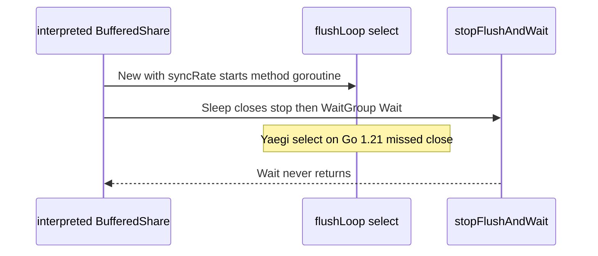

Developer review: ready for review — 2026-09-13T16:22:45Z

## What this changes
**Operators.** Traefik reload hooks (`Sleep`/`Close`) on a buffered window counter no longer hang when the plugin is interpreted.

**Admin users.** None.

**Developers.** `windowcounter` buffered flush is a stdlib `time.AfterFunc` timer. Interpreted `go` plus `select` on ticker/stop is gone. `TestYaegi_BufferedShareSleepDoesNotHang` fails in 3s if Sleep hangs.

**End users.** None.

## Motivation
Buffered window counters start a flush worker at `New`. DestBranch used an interpreted goroutine that selected on a ticker and a stop channel. `Sleep` and `Close` close stop and wait on a WaitGroup. Yaegi v0.16.1 can miss that close, so Wait never returns and the whole `go test` package binary dies at 300s. CI run 34766385613 showed that on Dragonfly `bufferedTwoClients`. Exact-mode tests in the same job had already passed. Traefik reload uses the same Sleep/Close hooks.

## Merge readiness
Apply landed. All eight CI checks succeeded.

Priority: P1 — Production is unsafe, losing data, or serving a wrong public contract today
Reviewed head: 27e0393
Owner decision: None.

## Review scores
| Measure | Result | What it means |
| --- | --- | --- |
| Overall readiness | 6/6 | Remote CI succeeded; no open comments |
| CI proof | 6/6 | All eight checks succeeded — [run 34768309738](https://github.com/david-garcia-garcia/traefik-middleware-utilities/actions/runs/34768309738) |
| Local tests proof | N/A | Remote PR; CI proof covers this |
| Review resolution | 6/6 | No PR comments |

## Verification
| Check | Result | Evidence |
| --- | --- | --- |
| Branch | 2026-09-13-windowcounter-bug-yaegi-flush-hang pushed | `git` origin |
| OpenSpec | windowcounter-afterfunc-flush archived | `openspec/changes/archive/2026-09-13-windowcounter-afterfunc-flush/` |
| Pull request | https://github.com/david-garcia-garcia/traefik-middleware-utilities/pull/75 | pr-host |
| CI | build 34768309738 succeeded https://github.com/david-garcia-garcia/traefik-middleware-utilities/actions/runs/34768309738 | pr-host CI |
| Local tests | passed | `go test -short ./...`; Go 1.21.13 Yaegi watchdog `-count=10`; live Yaegi Redis+Dragonfly 8× after FLUSHALL |
| PR comments | no comments | comments: none |

## Specs
- [std_go_windowcounter_sync-flush](https://github.com/david-garcia-garcia/traefik-middleware-utilities/blob/2026-09-13-windowcounter-bug-yaegi-flush-hang/openspec/changes/archive/2026-09-13-windowcounter-afterfunc-flush/proposal.md) — modified

## Deviations from the ask
None.

## Follow-up issues
- [ ] [Reclaim grace waiter still uses interpreted `go` + `select`](https://github.com/david-garcia-garcia/traefik-middleware-utilities/blob/2026-09-13-windowcounter-bug-yaegi-flush-hang/knowledge/debt/2026-09-13-reclaim-grace-select.md) — reclaim `waitGraceOrWake` still uses interpreted `go` plus timer/channel `select`.

## How this fits together
Local ticket on `origin/master` → PR 75. Hypothesis confirmed on Go 1.21.13. Flush path is AfterFunc. Supercede PR 61 for this deadlock.

## Explore Decisions
None.

## Before merge
None.

## Findings
None.

## Axis review
[Standards](https://github.com/david-garcia-garcia/traefik-middleware-utilities/blob/2026-09-13-windowcounter-bug-yaegi-flush-hang/devstate/2026/09/2026-09-13-windowcounter-bug-yaegi-flush-hang/codereview_standards.md) — 0 total, 0 pending, 0 completed
[Nitpicks](https://github.com/david-garcia-garcia/traefik-middleware-utilities/blob/2026-09-13-windowcounter-bug-yaegi-flush-hang/devstate/2026/09/2026-09-13-windowcounter-bug-yaegi-flush-hang/codereview_nitpicks.md) — 0 total, 0 pending, 0 completed
[Spec](https://github.com/david-garcia-garcia/traefik-middleware-utilities/blob/2026-09-13-windowcounter-bug-yaegi-flush-hang/devstate/2026/09/2026-09-13-windowcounter-bug-yaegi-flush-hang/codereview_spec.md) — 0 total, 0 pending, 0 completed
[Security](https://github.com/david-garcia-garcia/traefik-middleware-utilities/blob/2026-09-13-windowcounter-bug-yaegi-flush-hang/devstate/2026/09/2026-09-13-windowcounter-bug-yaegi-flush-hang/codereview_security.md) — 0 total, 0 pending, 0 completed
[Performance](https://github.com/david-garcia-garcia/traefik-middleware-utilities/blob/2026-09-13-windowcounter-bug-yaegi-flush-hang/devstate/2026/09/2026-09-13-windowcounter-bug-yaegi-flush-hang/codereview_performance.md) — 0 total, 0 pending, 0 completed
[Dead](https://github.com/david-garcia-garcia/traefik-middleware-utilities/blob/2026-09-13-windowcounter-bug-yaegi-flush-hang/devstate/2026/09/2026-09-13-windowcounter-bug-yaegi-flush-hang/codereview_dead.md) — 0 total, 0 pending, 0 completed
[Test coverage](https://github.com/david-garcia-garcia/traefik-middleware-utilities/blob/2026-09-13-windowcounter-bug-yaegi-flush-hang/devstate/2026/09/2026-09-13-windowcounter-bug-yaegi-flush-hang/codereview_coverage.md) — 0 total, 0 pending, 0 completed

## Agent review details

### Review metrics
| Metric | Value | Why it matters |
| --- | --- | --- |
| Specs in this PR | 0 added / 1 modified | Same list as Specs |
| Open reviewer comments walked | 0 FIX / 0 ANSWER / 0 open | Unanswered review is merge risk |
| Reviewed head | 27e039387061a3ca9d2f5d4653a1880675e273ca | Card must match the branch you measured |

### Stored data model
None.

### Technical review
Best possible solution: DestBranch's interpreted `go`+`select` flush is replaced with `time.AfterFunc`, the same compiled-waiter move `simpleredis` already made.

Do we have a high-confidence way to reproduce? Yes — Go 1.21.13 `TestScratchYaegiBufferedShareSleep` hung at 8s with `WaitGroup.Wait` and two `interp._select` frames. Isolated ticker probe without windowcounter sources did not hang.

Is this the best way to solve the issue? Yes. AfterFunc keeps periodic flush. Opportunistic Take/Peek flush would leave idle deltas unflushed.

### Evidence
What I checked:
- Go 1.21.13 hang dump: goroutine 60 `sync.(*WaitGroup).Wait`; 62/63 `interp._select.func4` `run.go:3815`
- After: `go test -short ./...`; Yaegi watchdog `-count=10`; live Yaegi 8× Redis+Dragonfly
- CI run 34768309738: Lint, Unit, Unit race, Go E2E Redis, Go E2E Dragonfly, Integration Tests, Integration Tests Redis, Integration Tests Dragonfly all success
- Supercede PR 61 for this deadlock; dest already has `stopping`

### Rank-up moves
None.
