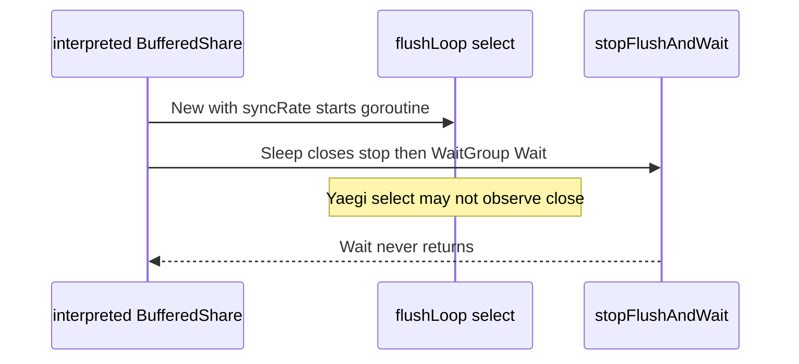

Developer review: in progress — 2026-09-13T16:03:48Z

## What this changes
**Operators.** None.

**Admin users.** None.

**Developers.** Ticket grounded on `origin/master`: interpreted `windowcounter` buffered `Sleep`/`Close` can hang Yaegi `Eval` until the 5-minute package timeout. No product code in this commit.

**End users.** None.

## Motivation
Buffered `windowcounter` starts a flush goroutine that selects on a ticker and a stop channel. Traefik and the live Yaegi tests run that code interpreted. `Sleep` and `Close` close stop and wait on the WaitGroup. DestBranch still uses that interpreted `go` plus `select`; `simpleredis` already abandoned the same pattern because Yaegi v0.16.1's select can miss a channel close.

CI run 34766385613 killed the whole `windowcounter` binary at 300.008s on `TestYaegiLive_RedisAndDragonfly/dragonfly/bufferedTwoClients`. Exact-mode subtests in the same job had already passed. If the interpreted select misses `close(stop)`, Traefik reload hooks (`Sleep`/`Close`) never return.

## Merge readiness
Prepare complete; explore has not confirmed the hang dump yet. 7 phases remain.

Priority: P1 — Production is unsafe, losing data, or serving a wrong public contract today
Reviewed head: c8061a0
Owner decision: None.

## Review scores
| Measure | Result | What it means |
| --- | --- | --- |
| Overall readiness | 1/6 | Stub PR exists; CI not seen; no apply yet |
| CI proof | 1/6 | Pushed; checks not seen |
| Local tests proof | N/A | Remote PR; CI proof covers this |
| Review resolution | 6/6 | No PR comments |

## Verification
| Check | Result | Evidence |
| --- | --- | --- |
| Branch | 2026-09-13-windowcounter-bug-yaegi-flush-hang pushed | `git` origin |
| OpenSpec | none | `openspec/` |
| Pull request | https://github.com/david-garcia-garcia/traefik-middleware-utilities/pull/75 | pr-host Create |
| CI | not seen | pr-host CI |
| Local tests | none | handoff.yaml localTests |
| PR comments | no comments | comments: none |

## Specs
None.

## Deviations from the ask
None.

## Follow-up issues
None.

## How this fits together
Local ticket on `origin/master` → branch `2026-09-13-windowcounter-bug-yaegi-flush-hang` → stub PR 75. Explore next: hang dump plus a minimal Yaegi ticker/stop probe.

## Explore Decisions
None.

## Before merge
- [ ] Confirm or refute the interpreted `flushLoop` select hang with a dump and a minimal probe
- [ ] Remove interpreted `go` + `select` from the flush path without changing Sleep/Wake/Close semantics
- [ ] Sweep sibling interpreted packages; note non-trivial hits
- [ ] Measured CI green on PR 75

## Findings
None.

## Axis review
None.

## Agent review details

### Review metrics
| Metric | Value | Why it matters |
| --- | --- | --- |
| Specs in this PR | none | Same list as Specs |
| Open reviewer comments walked | 0 FIX / 0 ANSWER / 0 open | Unanswered review is merge risk |
| Reviewed head | c8061a0ad0e9613761ba1ed55d723dd5eadfc964 | Card must match the branch you measured |

### Stored data model
None.

### Technical review
Best possible solution: DestBranch still runs an interpreted flush `select`; this run has only grounded that fact.

Do we have a high-confidence way to reproduce? No, the CI hang is intermittent; explore must build a dump and a minimal probe.

Is this the best way to solve the issue? Not yet — confirm the hang before changing the flush owner.

### Evidence
What I checked:
- `origin/master` `windowcounter/limiter.go` `flushLoop` / `stopFlushAndWait` / `stopping` (git show `c230315`)
- `simpleredis/resp.go` Yaegi AfterFunc note
- Unmerged PR 61 is the compiled Sleep/Wake race, already on dest
- Stub PR 75 created from this branch

### Rank-up moves
None.
