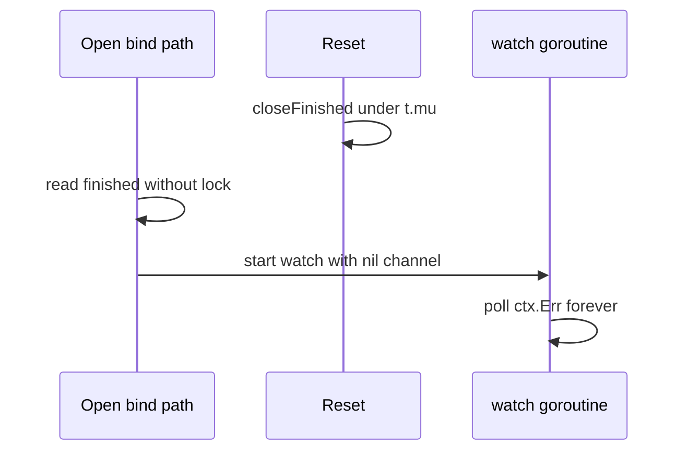

Developer review: in progress — 2026-09-14T15:21:46Z

## What this changes
**Operators.** None.

**Admin users.** None.

**Developers.** OpenSpec change `reclaim-finished-race-lock-defer` folds bind-time `finished` snapshot, deferred mutex unlock, and `Open` error on `Table{}` into `std_go_reclaim_context-lease`. `reclaim/table.go` is still DestBranch.

**End users.** None.

## Motivation
The reclaim table keeps one value per key and drops holders when their context ends. On `master`, two holes remain in that table.

A nil-Done holder can bind while `Reset` ends the incarnation: `dropWhenDone` reads `slot.finished` without `t.mu`, `closeFinished` nils it under the lock, and the watcher starts on a nil channel. That watcher then polls `ctx.Err` for the life of the process. Measured: 20 leaked goroutines across 20 keys, and a Docker `-race` report at `table.go:414` against `table.go:192`.

Separately, no lock-held region unlocks with `defer`. A panic under `t.mu` is recovered at the Yaegi plugin boundary, so the process keeps running with every later `Open` blocked. Measured: `Open` on `Table{}` panics `assignment to entry in nil map` and `Reset` never acquires the mutex.

If we do not merge, CI `-race` can flake on the bind path, the nil-Done leak PR #77 claimed fixed stays open, and one recovered panic freezes that table for the rest of the Traefik process.

## Merge readiness
Propose complete; implement not started. 5 workflow phases remain.

Priority: P2 — real process leak and mutex wedge under Yaegi with limited blast radius per table instance.
Reviewed head: 5dd86a4
Owner decision: None.

## Review scores
| Measure | Result | What it means |
| --- | --- | --- |
| Overall readiness | 3/6 | Proposal landed; product fix not applied |
| CI proof | 6/6 | last measured workflow 34860199374 succeeded — https://github.com/david-garcia-garcia/traefik-middleware-utilities/actions/runs/34860199374 |
| Local tests proof | N/A | Remote PR; implement has not run local proof |
| Review resolution | 6/6 | No open PR review comments inventoried |

## Verification
| Check | Result | Evidence |
| --- | --- | --- |
| Branch | 2026-09-14-reclaim-bug-finished-race-lock-defer pushed | git HEAD 5dd86a4 |
| OpenSpec | reclaim-finished-race-lock-defer | openspec/changes/reclaim-finished-race-lock-defer/ |
| Pull request | https://github.com/david-garcia-garcia/traefik-middleware-utilities/pull/91 | handoff.yaml |
| CI | build 34860199374 succeeded https://github.com/david-garcia-garcia/traefik-middleware-utilities/actions/runs/34860199374 | last measured check runs on PR 91 |
| Local tests | none | handoff.yaml localTests |
| PR comments | no comments | comments.md absent |

## Specs
- [std_go_reclaim_context-lease](https://github.com/david-garcia-garcia/traefik-middleware-utilities/blob/2026-09-14-reclaim-bug-finished-race-lock-defer/openspec/changes/reclaim-finished-race-lock-defer/proposal.md) — modified

## Deviations from the ask
None.

## Follow-up issues
None.

## How this fits together
Local ticket spec → branch `2026-09-14-reclaim-bug-finished-race-lock-defer` → PR #91 → OpenSpec change `reclaim-finished-race-lock-defer` ready to apply.

## Explore Decisions
| Question | Rank | Decision | By |
| --- | --- | --- | --- |
| How should lock-held regions in Open, drop, and reclaimLocked be extracted so every unlock is defer without moving hook/slog/close(ready) under the mutex? | additive asked | assumed — one helper per lock-held region that returns the decision and any channel the caller must close; reclaimLocked's called-holding-the-lock contract goes away by folding the asleep case into Open's lookup helper | explore |
| Which spec leaf owns the synchronized finished read, the nil-watch skip, deferred unlock, and Open error on Table{}? | additive asked | assumed — modify std_go_reclaim_context-lease; do not add a third reclaim spec family; value-lifecycle stays event order | explore |
| Should Open return an error for zero-value Table{} (nil items) in addition to the defer refactor? | additive asked | assumed — take it as an addition, never as a substitute for defer. Error copy matches the existing nil-table / nil-logger form | explore |
| Does this change need a Yaegi interp probe that recovers a panic under t.mu, or is compiled recover() enough? | additive incidental | assumed — compiled recover plus the put ready double-close injection is the proof; do not add a Traefik/Yaegi panic probe in this change | explore |

## Before merge
- [ ] [P2] Implement synchronized `finished` read plus defer-unlock refactor in `reclaim/table.go`
- [ ] [P2] Land repro tests and meet acceptance (`-race`, coverage floor)
- [x] Prepare devstate bus and stub PR
- [x] Explore: reproduce both defects and write assumed decisions
- [x] Propose OpenSpec change `reclaim-finished-race-lock-defer`

## Findings
None.

## Axis review
None.

## Agent review details

### Review metrics
| Metric | Value | Why it matters |
| --- | --- | --- |
| Specs in this PR | 0 added / 1 modified | Same list as Specs |
| Open reviewer comments walked | 0 FIX / 0 ANSWER / 0 open | No PR thread inventory |
| Reviewed head | 5dd86a426c4b4747fb3e35891f609187c4a56a08 | OpenSpec proposal commit |

### Stored data model
None.

### Technical review
Best possible solution: not landed in `table.go` yet — DestBranch still has the unsynchronized `finished` read and bare unlocks. The change artifacts name the helper extraction and the `put` ready-injection repro.

Do we have a high-confidence way to reproduce? Yes. Leak, wedge, and Docker `-race` all failed on DestBranch in explore.

Is this the best way to solve the issue? Yes versus DestBranch: locked snapshot plus nil skip, defer-unlock helpers, and `Open` error on `Table{}` as an addition.

### Evidence
What I checked:
- FindSpecHost fold into `std_go_reclaim_context-lease` (candidates: context-lease, value-lifecycle)
- `openspec validate --changes reclaim-finished-race-lock-defer --strict` passed
- `validate_artifact_names` OK
- Last CI on PR 91: workflow 34860199374 all success

### Rank-up moves
None.
