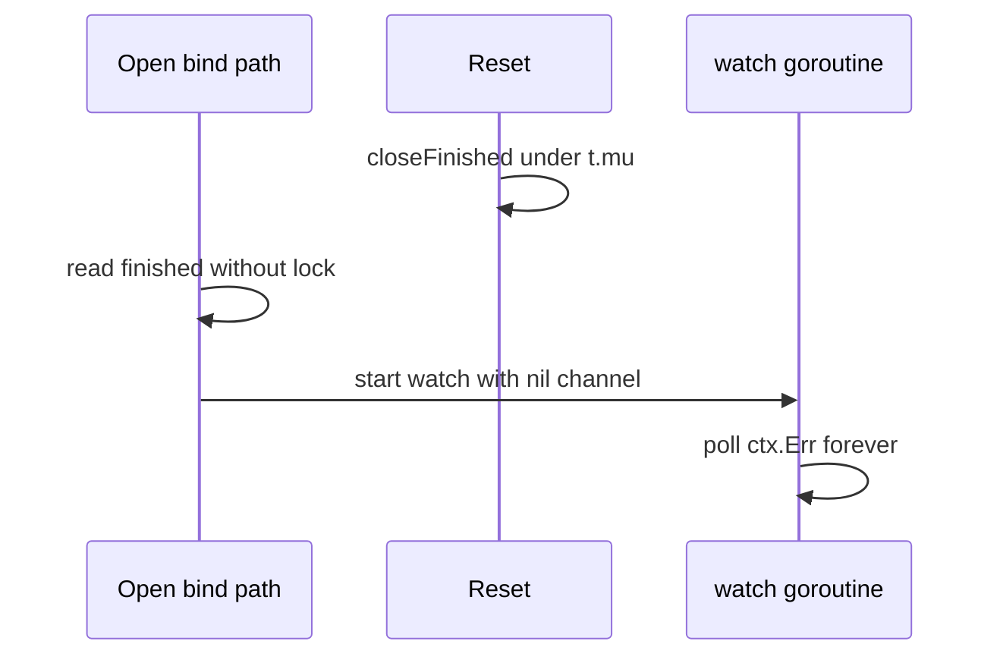

Developer review: in progress — 2026-09-14T15:08:05Z

## What this changes
**Operators.** None.

**Admin users.** None.

**Developers.** Prepare only: OpenDev bus under `devstate/2026/09/2026-09-14-reclaim-bug-finished-race-lock-defer/`; product fix for `reclaim/table.go` not landed yet.

**End users.** None.

## Motivation
The reclaim table deduplicates expensive creates per key and drops holders when their context ends. On `master`, two concurrency holes remain in `reclaim/table.go`.

First, `dropWhenDone` reads `incarnation.finished` without holding `t.mu` while `Reset` clears that field under the lock. A nil-`Done` holder can bind in the gap, start a watcher on a nil channel, and leak a polling goroutine per key (the bind-path hole behind the earlier nil-Done leak fix).

Second, no mutex region uses `defer` to unlock. A panic while holding `t.mu` is fatal in normal Go but under Yaegi recovery the process continues with the table wedged. Zero-value `Table{}` already panics on nil map assignment with the lock held.

If we do not merge a fix, Traefik plugins can accumulate leaked watchers and silently freeze all reclaim opens after one recovered panic.

## Merge readiness
Prepare complete; implement not started. 7 workflow phases remain after explore.

Priority: P2 — real process leak and mutex wedge under Yaegi with limited blast radius per table instance.
Reviewed head: fb61072
Owner decision: None.

## Review scores
| Measure | Result | What it means |
| --- | --- | --- |
| Overall readiness | 3/6 | CI green on stub branch; product change and explore not done |
| CI proof | 6/6 | workflow run 34859764486 succeeded — https://github.com/david-garcia-garcia/traefik-middleware-utilities/actions/runs/34859764486 |
| Local tests proof | N/A | Remote PR; implement has not run local proof |
| Review resolution | 6/6 | No open PR review comments inventoried |

## Verification
| Check | Result | Evidence |
| --- | --- | --- |
| Branch | 2026-09-14-reclaim-bug-finished-race-lock-defer pushed | git push |
| OpenSpec | none | openspec/ |
| Pull request | https://github.com/david-garcia-garcia/traefik-middleware-utilities/pull/91 | GitHub MCP create |
| CI | build 34859764486 succeeded https://github.com/david-garcia-garcia/traefik-middleware-utilities/actions/runs/34859764486 | check runs on PR 91 |
| Local tests | none | handoff.yaml localTests |
| PR comments | no comments | devstate/comments.md absent |

## Specs
None.

## Deviations from the ask
None.

## Follow-up issues
None.

## How this fits together
Local ticket spec → branch `2026-09-14-reclaim-bug-finished-race-lock-defer` → stub PR #91 → CI workflow 34859764486 green on devstate-only delta.

## Explore Decisions
None.

## Before merge
- [ ] [P2] Explore and implement synchronized `finished` read plus defer-unlock refactor in `reclaim/table.go`
- [ ] [P2] Land repro tests and meet acceptance (`-race`, coverage floor)
- [x] Prepare devstate bus and stub PR

## Findings
None.

## Axis review
None.

## Agent review details

### Review metrics
| Metric | Value | Why it matters |
| --- | --- | --- |
| Specs in this PR | none | No spec delta yet |
| Open reviewer comments walked | 0 FIX / 0 ANSWER / 0 open | No PR thread inventory |
| Reviewed head | fb61072 | Matches branch at card write |

### Stored data model
None.

### Technical review
Best possible solution: not evaluated — no product diff versus `master` yet.

Do we have a high-confidence way to reproduce? Yes, repro tests exist in main checkout (to land in implement).

Is this the best way to solve the issue? Pending implement; ticket specifies locked read with nil guard and defer-based unlock helpers.

### Evidence
What I checked:
- `reclaim/table.go` on `origin/master` (`dropWhenDone`, mutex pattern) at prepare time
- CI check runs on PR 91 (workflow 34859764486, all success)

### Rank-up moves
None.
