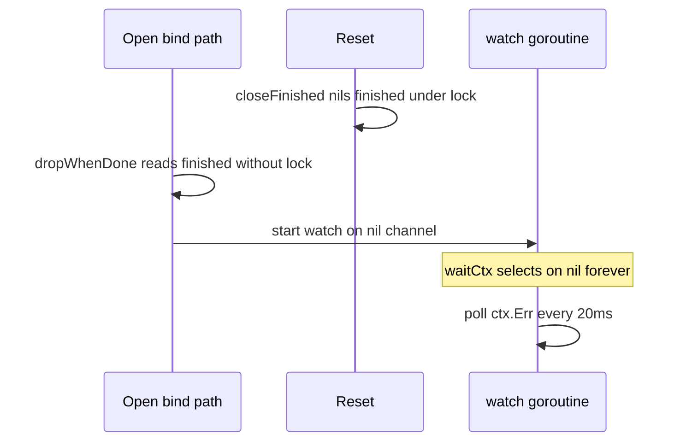

Developer review: ready for review — 2026-09-14T15:52:39Z

## What this changes
**Operators.** None.

**Admin users.** None.

**Developers.** `reclaim/table.go` snapshots `slot.finished` under `t.mu` and skips `watch` when that snapshot is nil; every lock-held region unlocks with `defer`; `Open` on `Table{}` returns an error. Repros in `reclaim/repro_finished_race_test.go` and `reclaim/repro_mutex_wedge_test.go`.

**End users.** None.

## Motivation
The reclaim table keeps one value per key and drops holders when their context ends. On `master`, two holes remain in that table.

A nil-Done holder can bind while `Reset` ends the incarnation: `dropWhenDone` reads `slot.finished` without `t.mu`, `closeFinished` nils it under the lock, and the watcher starts on a nil channel. That watcher then polls `ctx.Err` for the life of the process and keeps the key, the dead slot, and its value reachable.

Separately, no lock-held region unlocked with `defer`. A panic under `t.mu` is recovered at the Yaegi plugin boundary, so the process keeps running with every later `Open` on every key of that table blocked.

If we do not merge, CI `-race` can flake on the bind path, the nil-Done leak PR #77 claimed fixed stays open, and one recovered panic freezes that table for the rest of the Traefik process.

## Merge readiness
Ready for review. 0 items remain.

Priority: P2 — real process leak and mutex wedge under Yaegi with limited blast radius per table instance.
Reviewed head: 048004c
Owner decision: None.

## Review scores
| Measure | Result | What it means |
| --- | --- | --- |
| Overall readiness | 6/6 | CI succeeded; checklist closed |
| CI proof | 6/6 | workflow run 34864724861 succeeded — https://github.com/david-garcia-garcia/traefik-middleware-utilities/actions/runs/34864724861 |
| Local tests proof | N/A | Remote PR; local `./reclaim/` passed, Docker `-race` passed, coverage 95.1% |
| Review resolution | 6/6 | No open PR review comments inventoried |

## Verification
| Check | Result | Evidence |
| --- | --- | --- |
| Branch | 2026-09-14-reclaim-bug-finished-race-lock-defer pushed | git HEAD 048004c4df8da834c5c981d388575afc7b14498b |
| OpenSpec | reclaim-finished-race-lock-defer archived | openspec/changes/archive/2026-09-14-reclaim-finished-race-lock-defer/ |
| Pull request | https://github.com/david-garcia-garcia/traefik-middleware-utilities/pull/91 | handoff.yaml |
| CI | build 34864724861 succeeded https://github.com/david-garcia-garcia/traefik-middleware-utilities/actions/runs/34864724861 | GitHub check runs on PR 91 (Lint, Unit, Unit race, e2e, integration) |
| Local tests | passed | handoff.yaml; `go test ./reclaim/` 7.15s; Docker `-race` 10.98s; cover 95.1% |
| PR comments | no comments | comments.md absent |

## Specs
- [std_go_reclaim_context-lease](https://github.com/david-garcia-garcia/traefik-middleware-utilities/blob/2026-09-14-reclaim-bug-finished-race-lock-defer/openspec/changes/archive/2026-09-14-reclaim-finished-race-lock-defer/proposal.md) — modified

## Deviations from the ask
None.

## Follow-up issues
None.

## How this fits together
Local ticket spec → branch `2026-09-14-reclaim-bug-finished-race-lock-defer` → PR #91 → apply at 71de2bc, live spec folded at 048004c → CI 34864724861 green.

## Explore Decisions
| Question | Rank | Decision | By |
| --- | --- | --- | --- |
| How should lock-held regions in Open, drop, and reclaimLocked be extracted so every unlock is defer without moving hook/slog/close(ready) under the mutex? | additive asked | assumed — one helper per lock-held region that returns the decision and any channel the caller must close; reclaimLocked's called-holding-the-lock contract goes away by folding the asleep case into Open's lookup helper | explore |
| Which spec leaf owns the synchronized finished read, the nil-watch skip, deferred unlock, and Open error on Table{}? | additive asked | assumed — modify std_go_reclaim_context-lease; do not add a third reclaim spec family; value-lifecycle stays event order | explore |
| Should Open return an error for zero-value Table{} (nil items) in addition to the defer refactor? | additive asked | assumed — take it as an addition, never as a substitute for defer. Error copy matches the existing nil-table / nil-logger form | explore |
| Does this change need a Yaegi interp probe that recovers a panic under t.mu, or is compiled recover() enough? | additive incidental | assumed — compiled recover plus the put ready double-close injection is the proof; do not add a Traefik/Yaegi panic probe in this change | explore |

## Before merge
None.

## Findings
None.

## Axis review
[Standards](https://github.com/david-garcia-garcia/traefik-middleware-utilities/blob/2026-09-14-reclaim-bug-finished-race-lock-defer/devstate/2026/09/2026-09-14-reclaim-bug-finished-race-lock-defer/codereview_standards.md) — 0 total, 0 pending, 0 completed
[Nitpicks](https://github.com/david-garcia-garcia/traefik-middleware-utilities/blob/2026-09-14-reclaim-bug-finished-race-lock-defer/devstate/2026/09/2026-09-14-reclaim-bug-finished-race-lock-defer/codereview_nitpicks.md) — 3 total, 0 pending, 3 completed
[Spec](https://github.com/david-garcia-garcia/traefik-middleware-utilities/blob/2026-09-14-reclaim-bug-finished-race-lock-defer/devstate/2026/09/2026-09-14-reclaim-bug-finished-race-lock-defer/codereview_spec.md) — 0 total, 0 pending, 0 completed
[Security](https://github.com/david-garcia-garcia/traefik-middleware-utilities/blob/2026-09-14-reclaim-bug-finished-race-lock-defer/devstate/2026/09/2026-09-14-reclaim-bug-finished-race-lock-defer/codereview_security.md) — 0 total, 0 pending, 0 completed
[Performance](https://github.com/david-garcia-garcia/traefik-middleware-utilities/blob/2026-09-14-reclaim-bug-finished-race-lock-defer/devstate/2026/09/2026-09-14-reclaim-bug-finished-race-lock-defer/codereview_performance.md) — 0 total, 0 pending, 0 completed
[Dead](https://github.com/david-garcia-garcia/traefik-middleware-utilities/blob/2026-09-14-reclaim-bug-finished-race-lock-defer/devstate/2026/09/2026-09-14-reclaim-bug-finished-race-lock-defer/codereview_dead.md) — 0 total, 0 pending, 0 completed
[Test coverage](https://github.com/david-garcia-garcia/traefik-middleware-utilities/blob/2026-09-14-reclaim-bug-finished-race-lock-defer/devstate/2026/09/2026-09-14-reclaim-bug-finished-race-lock-defer/codereview_coverage.md) — 0 total, 0 pending, 0 completed

## Agent review details

### Review metrics
| Metric | Value | Why it matters |
| --- | --- | --- |
| Specs in this PR | 0 added / 1 modified | Same list as Specs |
| Open reviewer comments walked | 0 FIX / 0 ANSWER / 0 open | No PR thread inventory |
| Reviewed head | 048004c4df8da834c5c981d388575afc7b14498b | Archived change plus live spec fold |

### Stored data model
None.

### Technical review
Best possible solution: yes versus DestBranch — locked `finished` snapshot plus nil skip closes the bind-path leak; 14 lock-held helpers all `defer Unlock`; `Open` on `Table{}` errors instead of panicking under the lock.

Do we have a high-confidence way to reproduce? Yes. The three repros now pass; Docker `-race` is green; CI Unit race succeeded.

Is this the best way to solve the issue? Yes versus DestBranch. A nil-map guard alone would have skipped the wedge repro.

### Evidence
What I checked:
- `go test -count=1 -timeout 10m ./reclaim/` passed (7.15s)
- Docker `golang:1.25 go test -race -count=1 -timeout 10m ./reclaim/` passed (10.98s)
- Coverage 95.1% of statements (DestBranch floor 94.4%)
- CI run 34864724861: Lint, Unit, Unit race, Go E2E Redis/Dragonfly, Integration Tests (Redis/Dragonfly) all success
- 14 `t.mu.Lock()` sites, each followed by `defer t.mu.Unlock()`
- PR title is `🐛 fix(reclaim): stop bind-path watcher leak and mutex wedge`

### Rank-up moves
None.
