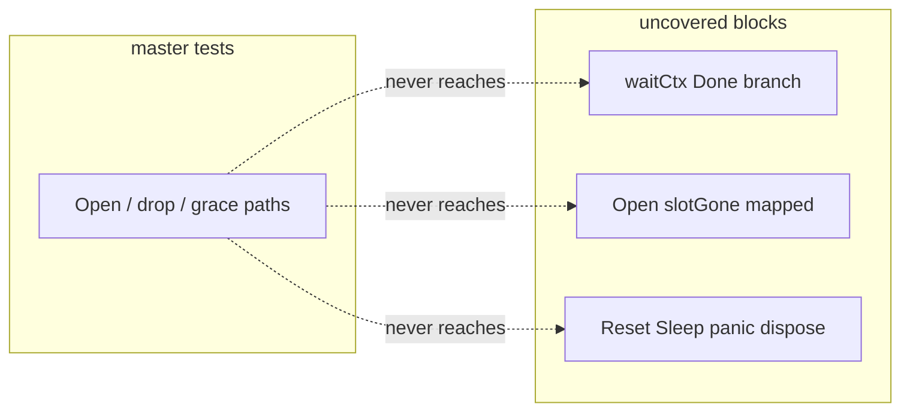

Developer review: in progress — 2026-09-14T15:06:22Z

## What this changes
**Operators.** None.

**Admin users.** None.

**Developers.** None on `origin/master...HEAD` yet; implement will add `reclaim/table_gaps_test.go` only so `reclaim` reaches 100% statement coverage and pins two Reset behaviours documented in `knowledge/devdocs/std_go_reclaim.md`, without editing `reclaim/table.go`.

**End users.** None.

## Motivation
Middleware plugins hold keyed values through `reclaim.Table`. On `master`, package tests leave nine statement blocks in `reclaim/table.go` unexecuted (~94.4% coverage per the ticket). Two of those gaps are documented Reset contracts (Sleep panic still disposes; Reset unmaps before EnforceCloseBeforeOpen) that nothing in `./reclaim/` asserts today.

Without tests on those ending paths, a refactor or Yaegi regression can change dispose/orphan ordering silently while CI still passes on the existing suite. The ticket lands caller-verified gap tests through the full workflow so spec and devdocs impact can record the contracts.

## Merge readiness
Prepare complete; explore not started. Stub PR open; product tests and gap file not landed. 5 items remain.

Priority: P3 — tests and internal clarity, no current operator harm
Reviewed head: 8915019
Owner decision: None.

## Review scores
| Measure | Result | What it means |
| --- | --- | --- |
| Overall readiness | 1/6 | Stub only; CI not measured |
| CI proof | 1/6 | Pushed; checks not seen yet |
| Local tests proof | N/A | Before implement on remote PR |
| Review resolution | N/A | No PR review comments inventoried |

## Verification
| Check | Result | Evidence |
| --- | --- | --- |
| Branch | 2026-09-14-reclaim-ending-path-test-coverage pushed | `git push` |
| OpenSpec | none | `handoff.yaml` |
| Pull request | https://github.com/david-garcia-garcia/traefik-middleware-utilities/pull/92 | GitHub Create |
| CI | not seen | pr-host CI |
| Local tests | none | `handoff.yaml` |
| PR comments | no comments | inventory empty |

## Specs
None.

## Deviations from the ask
None.

## Follow-up issues
None.

## How this fits together
Local ticket → branch `2026-09-14-reclaim-ending-path-test-coverage` from `origin/master` → stub PR #92 → CI to be measured on later commits.

## Explore Decisions
None.

## Before merge
- [ ] [P3] Explore gap analysis and dead-code notes (items 1, 2, 4) without deleting production code
- [ ] [P3] Implement `reclaim/table_gaps_test.go`; keep `reclaim/table.go` identical to `master`
- [ ] [P3] Propose / devdocsimpact for documented Reset contracts
- [ ] [P3] Code review and archive
- [ ] [P3] Pull request ready (CI green, comments walked)

## Findings
None.

## Axis review
None.

## Agent review details

### Review metrics
| Metric | Value | Why it matters |
| --- | --- | --- |
| Specs in this PR | 0 added / 0 modified | No OpenSpec change yet |
| Open reviewer comments walked | 0 FIX / 0 ANSWER / 0 open | Inventory empty at prepare |
| Reviewed head | 8915019 | Empty start commit only |

### Stored data model
None.

### Technical review
Best possible solution: not evaluated until implement lands tests.

Do we have a high-confidence way to reproduce? Not yet on branch; caller verified tests on `master` worktree copy.

Is this the best way to solve the issue? Pending explore/propose.

### Evidence
What I checked:
- `origin/master` contains `reclaim/table.go` and reclaim tests (no `table_gaps_test.go` on branch)
- Qualify: qualified-with-gaps

### Rank-up moves
None.
